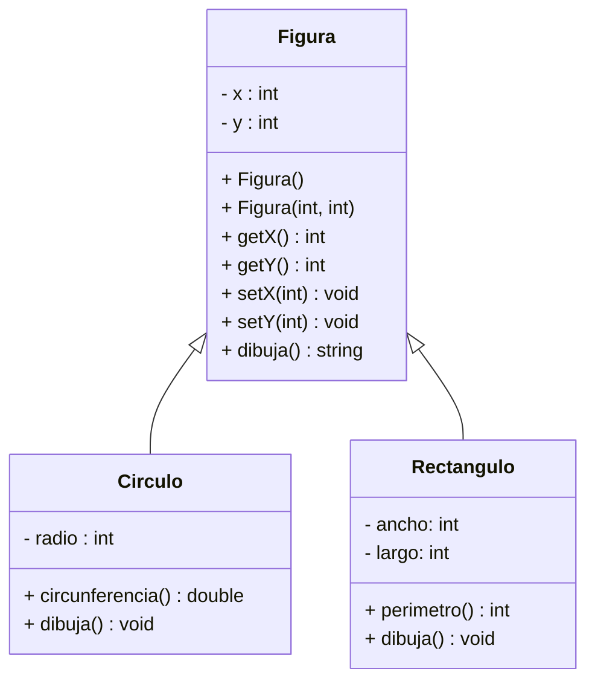

# Ejercicio - Figuras

- Este proyecto tiene la estructura básica para cualquier proyecto C++. 
- La carpeta contiene el código fuente y el archivo de construcción ```make```. 
- La carpeta `build` contiene el codigo binario generado por el archivo de construcción ```make```. 
- Consulta el archivo assignments/README.md para instrucciones sobre la compilación y ejecución del proyecto. 

## Instrucciones:
Usaremos este repositorio por al menos 3 sesiones de clases donde veremos los siguientes temas
- Herencia
- Polimorfismo
- Clases abstractas
- Inicio de sobrecarga de operadores

Durante las sesiones iremos haciendo cambios a las clases para mejorarlas y revisar de manera práctica los temas antes mencionados. 
De manera general, el siguiente es el diagrama de clases inicial:



Es importante que vayas siguiendo a la profesora en clase para que tengas tu ejemplo construido y corriendo y te sirva de base para tus tareas.
