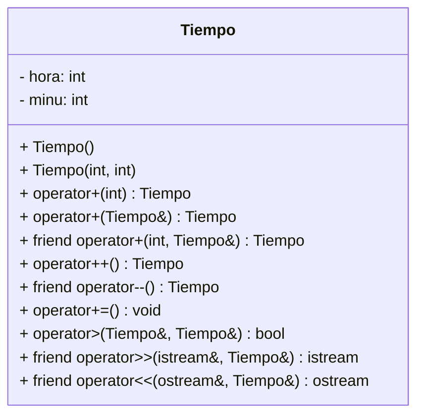

# Ejercicio-Autograding para C++ usando Catch2

**Fuente:** *Learning Autograding with C/C++ and Catch2 - Prof. Igor Machado Coelho* 
https://medium.com/swlh/easy-c-autograding-on-github-classroom-with-catch2-106ad1107402

## Descripción del Problema

## Ejecución

## Diagrama de Clases

El Diagrama de Clases del programa a desarrollar es el siguiente, usando el [Lenguaje Mermaid](https://mermaid.js.org/syntax/classDiagram.html).

## Objetivo

- Busca que el código pase correctamente todas las pruebas
   * Solamente cambia los archivos permitidos para lograr este objetivo (abajo se indican las reglas específicas)
   
- Las GitHub Actions deberán presentar una palomita en verde si se han satisfecho todas las pruebas, y una cruz roja cuando alguna (o todas) las pruebas han fallado.
   * **Recomendación:** Puedes dar clic en la cruz roja para verificar cual de las pruebas ha fallado (o si el código no ha compilado correctamente).
   * **Recomendación:** En caso de que el Autograding no muestre pruebas o no funcione, contacta a tu profesor mediante un issue.

## Instrucciones

- En el archivo `Tiempo.hpp` completa la definición de la clase, asegúrate de seguir las instrucciones que tiene el archivo como comentarios.
- En el archivo `Tiempo.cpp` completa las implementaciones de las sobrecargas de operadores que tiene la clase.
- Una vez que termines, compila y corre el programa con `make run`. 
- Te sugiero que una vez que lo corras, veas el código del main, ve cómo se están usando los operadores, pregunta si tienes dudas. Al main no debes cambiarle nada, pero asegúrate de entenderlo y de que corra bien.
- Ya que que corrió bien, ejecuta las pruebas con `make test`
- Dos cosas muy importantes debes tomar en cuenta, las horas pueden ser cualquier número positivo, los minutos sólo un número entre 0 y 59. Puedes cambiar los setters que te proporciono para tener la validación inicial al asignar.
- Al sobrecargar el operador de flujo de salida << deberás imprimir en el formato 00 para los minutos, por ejemplo 36 horas y 5 minutos, deberá imprimirse: **36:05**
- Cuando sobrecargues el operador de flujo de entrada >> se ingresan los dos números empezando por la hora separadas por espacio.
- Pide ayuda y revisa el ejercicio de Fracción realizado en clase.

Explicación de los otros archivos:

- Archivo `test/tests.cpp` tiene las pruebas de esta actividad (NO LO CAMBIES!)
- Archivo `test/catch.hpp` tiene la biblioteca de pruebas  CATCH2 (NO LA CAMBIES!)
- Archivo `makefile` tienes los comandos para ejecutar la actividad (NO LO CAMBIES!)
- Archivo  `./build/appTests` se generará después de compilar (para **pruebas locales**, solo ejecútalo)

## Comandos para pruebas locales, ejecución y depuración

- Comando para construir y ejecutar pruebas: `make` o `make test`
    * Si el ejecutable ya está construido, sólo teclea : `./build/appTests`

- Comando para construir y ejecutar la aplicación: `make run` 
    * Si el ejecutable ya está construido, sólo teclea : `./build/exercise`

- Comando para depurar: `make debug`
    * Para conocer los comandos de depuración consulta:
     https://u.osu.edu/cstutorials/2018/09/28/how-to-debug-c-program-using-gdb-in-6-simple-steps/
     
- Comando para depurar con `vsCode` en `GitPod`: `make debugvs` 
    * Utilizar el depurador de la IDE.     

## Notas

- El código será evaluado solamente si compila.
   * La razón de esto es, si no compila no es posible generar el ejecutable y realizar las pruebas.

- Algunos casos de prueba podrían recibir calificación individual, otros podrían recibir calificación y si pasan todos juntos (o todas las pruebas en conjunto).

- La calificación final se otorgará de manera automática en cada *commit*, y se evaluará solamente hasta la fecha limite de la actividad.

Para dudas adicionales, consulta a tu profesor.

## License

MIT License 2020
