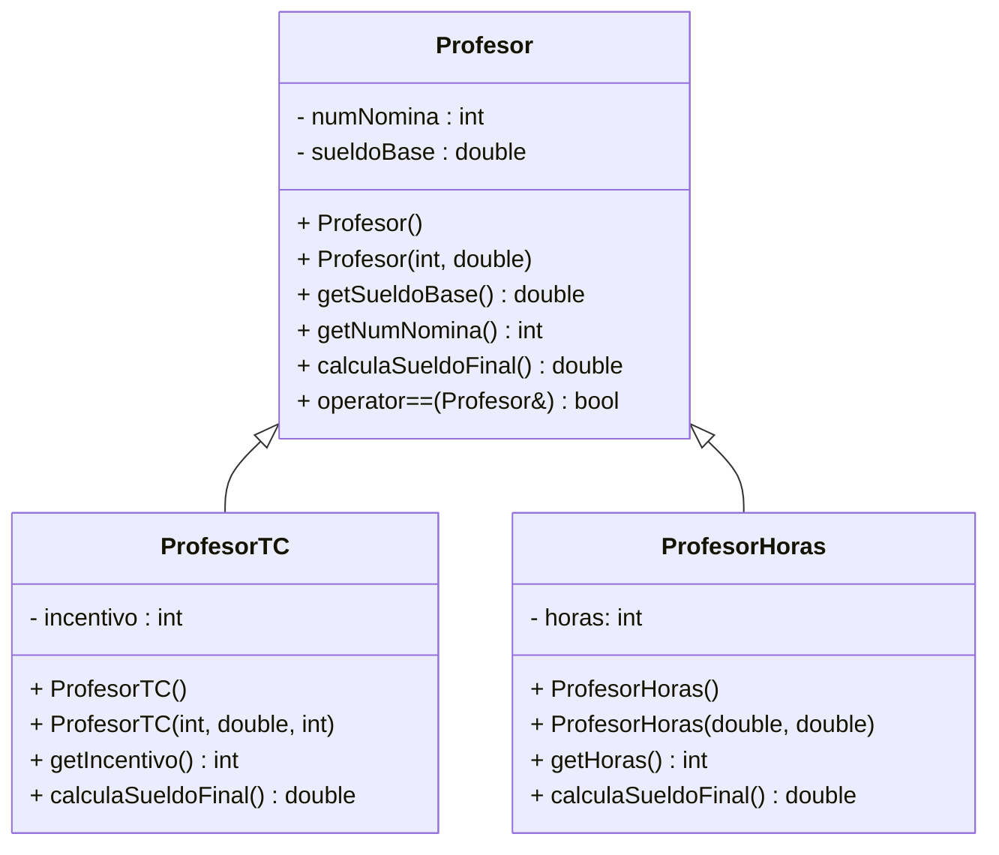

# Ejercicio-Autograding para C++ usando Catch2

**Fuente:** *Learning Autograding with C/C++ and Catch2 - Prof. Igor Machado Coelho* 
https://medium.com/swlh/easy-c-autograding-on-github-classroom-with-catch2-106ad1107402

# Instrucciones
**(60 puntos)** Implementa en C++ las clases mostradas en el diagrama de clases UML de abajo. Revisa en el apartado **Especificaciones**, algunos requerimientos que deberás considerar en la implementación.

## Diagrama de Clases

## Especificaciones

### Clase abstracta Profesor 
- Define la clase Profesor, el método calculaSueldoFinal() es virtual puro.
- Implementa constructores, getters y setters. Los valores default para numero de nómina es 0 y para sueldo base 200.0.
- Sobrecarga el operador == como función miembro de la clase. Un Profesor será igual a otro si y solo si tiene **el mismo sueldo final**. Al usar el método **calculaSueldoFinal()** que es polimórfico en tiempo de ejecución, hará que nuestra sobrecarga sea útil para toda nuestra estructura de clases heredadas.

### Clase ProfesorTC – es un Profesor
- Representa un profesor de tiempo completo.
- Agrega el atributo incentivo. *(Para este examen implementa solo el get del atributo).* 
- Agrega los constructores (default y con parámetros). El valor default de incentivo es 2.
- Escribe el método **calculaSueldoFinal()**, un profesor de tiempo completo, tiene un sueldo base al mes y se gana un % extra de incentivo por desempeño, calculado sobre el sueldo base. Por ejemplo si el sueldo base de un profesor es 10000 al mes y tiene un incentivo del 5% su sueldo final será: 10500.00

### Clase ProfesorHoras – es un Profesor
- Representa un profesor que trabaja por horas. 
- Agrega el atributo horas. *(Para este examen implementa solo el get del atributo).* 
- Agrega los constructores (default y con parámetros). El valor default para horas es 1.
- Escribe el método **calculaSueldoFinal()**, el cual se calcula multiplicando el sueldo base que para estos profesores corresponde a lo que se le paga por hora y se multiplica por el número de horas que trabaja al mes.

### Programa principal

**(10 puntos)** En el programa principal:
- Crea un vector de apuntadores a Profesor llamado profesores.
- De manera dinámica crea:
 * En la posición 0 un objeto ProfesorHoras con numero de nómina 112, sueldo base 150.35 y 40 horas.
 * En la posición 1 un objeto ProfesorTC con número de nómina 111,sueldo base 20000.00 y 5% de incentivo.
 * En la posición 2 un objeto ProfesorHoras con número de nómina 110, sueldo base 375.00 y 50 horas.

- Declara un objeto ProfesorTC llamado p1 con los datos: número de nómina 100, sueldo base 15000.00 e incentivo de 25%.
- Ahora recorre el vector para encontrar cual(es) de los profesores **son iguales** que p1. No se te olvide que lo que tienes guardado en el vector son **apuntadores a Profesor** y recuerda que implementamos la sobrecarga del **operador ==** para Profesor (debes usar este operador para esta parte del examen).
  * Si encuentras profesores iguales a p1, sólo tienes que desplegar un mensaje a pantalla como este: *Profesor en la posición X tiene el mismo sueldo que p1” (donde X es el número correspondiente a la posición del arreglo donde está ese profesor que tiene igual sueldo que p1).
 * También conforme recorras el archivo ve imprimiendo a pantalla el sueldo de cada profesor, usa un buen formato para el mensaje.

## Objetivo

- Busca que el código pase correctamente todas las pruebas, al pasar todas las pruebas te dará una calificación de 60, los 10 puntos restantes los pondrá la maestra directamente revisando el código del main.

   * Solamente cambia los archivos permitidos para lograr este objetivo (archivos de tus clases y el exercise.cpp como programa principal)
   
- Las GitHub Actions deberán presentar una palomita en verde si se han satisfecho todas las pruebas, y una cruz roja cuando alguna (o todas) las pruebas han fallado.
   * **Recomendación:** Puedes dar clic en la cruz roja para verificar cual de las pruebas ha fallado (o si el código no ha compilado correctamente).
   * **Recomendación:** En caso de que el Autograding no muestre pruebas o no funcione, contacta a tu profesor mediante un issue.

# Explicación de los otros archivos:

- Archivo `test/tests.cpp` tiene las pruebas de esta actividad (NO LO CAMBIES!)
- Archivo `test/catch.hpp` tiene la biblioteca de pruebas  CATCH2 (NO LA CAMBIES!)
- Archivo `makefile` tienes los comandos para ejecutar la actividad (NO LO CAMBIES!)
- Archivo  `./build/appTests` se generará después de compilar (para **pruebas locales**, solo ejecútalo)

## Comandos para pruebas locales, ejecución y depuración

- Comando para construir y ejecutar pruebas: `make` o `make test`
    * Si el ejecutable ya está construido, sólo teclea : `./build/appTests`

- Comando para construir y ejecutar la aplicación: `make run` 
    * Si el ejecutable ya está construido, sólo teclea : `./build/exercise`

- Comando para depurar: `make debug`
    * Para conocer los comandos de depuración consulta:
     https://u.osu.edu/cstutorials/2018/09/28/how-to-debug-c-program-using-gdb-in-6-simple-steps/
     
- Comando para depurar con `vsCode` en `GitPod`: `make debugvs` 
    * Utilizar el depurador de la IDE.     

## Notas

- El código será evaluado solamente si compila.
   * La razón de esto es, si no compila no es posible generar el ejecutable y realizar las pruebas.

- Algunos casos de prueba podrían recibir calificación individual, otros podrían recibir calificación y si pasan todos juntos (o todas las pruebas en conjunto).

- La calificación final se otorgará de manera automática en cada *commit*, y se evaluará solamente hasta la fecha limite de la actividad.

Para dudas adicionales, consulta a tu profesor.

## License

MIT License 2020
